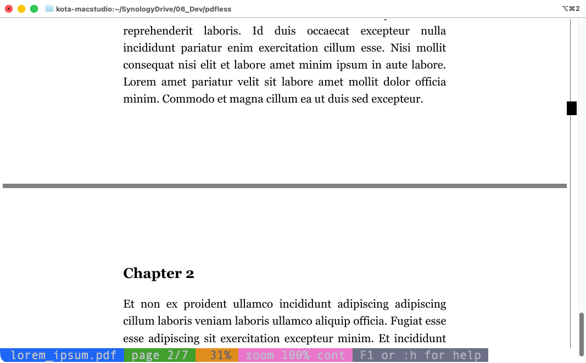

# pdfless

[English](README.md)

`less(1)`と同様のキー操作でPDFや画像を閲覧できる，全画面表示のページャです．
ローカルでもSSH経由でも，ターミナル上で直接文書を閲覧できます．

`pdfless`には，[iTerm2](https://iterm2.com)のインライン画像プロトコルに対応したターミナルが必要です．
[iTerm2](https://iterm2.com)と[WezTerm](https://wezterm.org)で動作確認済みです．

---

## 主な機能

- PDF，画像（PNG／JPEG／GIFなど），プレーンテキストファイルをターミナル上に表示．
- 追加の依存ソフトウェアを導入すれば，Office文書，SVG，Markdownにも対応．
- キーボードやマウスによるスクロール，拡大・縮小，表示位置の移動．
- ページをまたいだ連続表示．
- PDF内のテキスト検索と，外部・内部リンクへの移動．
- PDFの目次（しおり）から各節への移動．
- テキストモードに切り替えて，抽出したテキストを閲覧・コピー．
- クリックやドラッグで操作できるスクロールバーの表示．
- 複数のファイルを開いて切り替え．
- 表示中のファイルが更新された際の自動再読み込み（追従モード有効時）．

## スクリーンショット

| 表示 | スクリーンショット |
| --- | --- |
| 幅に合わせて表示 |  |
| 高さに合わせて表示 |  |
| 拡大と表示位置の移動 |  |
| 画像モードでの検索 |  |
| テキストモードでの検索 |  |
| PDFのハイパーリンク |  |
| 目次 |  |
| 連続表示 |  |
| 画像ファイル |  |
| キー操作のヘルプ |  |

## インストール

Python 3.9以降，[uv](https://docs.astral.sh/uv/)，および対応するターミナルが必要です．
PDFの表示には[Poppler](https://poppler.freedesktop.org)も必要です．
通常の画像ファイルのみを表示する場合，Popplerは不要です．

必要なソフトウェアをインストールします．

```sh
# macOS (Homebrew)
brew install uv poppler

# Ubuntu / Debian
sudo apt install poppler-utils
curl -LsSf https://astral.sh/uv/install.sh | sh
```

リポジトリをクローンして，ファイルを開きます．
初回実行時に，`uv`が必要なPythonパッケージを自動的にインストールします．

```sh
git clone https://github.com/ktabe/pdfless.git
cd pdfless
./pdfless.py document.pdf
```

`pdfless`というコマンド名で実行するには，`PATH`に含まれる書き込み可能なディレクトリにスクリプトをコピーします．

```sh
cp pdfless.py /usr/local/bin/pdfless
chmod +x /usr/local/bin/pdfless
```

Pythonパッケージを自分でインストールすれば，`uv`を使わずに実行することもできます．

```sh
pip install pillow pypdf markdown weasyprint
python3 pdfless.py document.pdf
```

その他の文書形式については[追加の対応形式（実験的機能）](#追加の対応形式実験的機能)を，
tmux内での利用については[注意事項](#注意事項)を参照してください．

## 使い方

```sh
pdfless document.pdf           # PDFを開く
pdfless image.png              # 画像を開く
pdfless notes.txt              # テキストファイルを開く
pdfless report.pdf chart.png   # 複数のファイルを開く
pdfless -p 10 document.pdf     # 10ページ目から表示
pdfless -h slides.pdf          # 各ページをターミナルの高さに合わせて表示
pdfless -f document.pdf        # ファイルの更新時に再読み込み
pdfless -F document.pdf        # 1画面に収まる場合は表示して終了
cat document.pdf | pdfless     # 標準入力から読み込む
```

デフォルトでは，ページをターミナルの幅に合わせて表示します．
`j` / `k`でスクロール，`Space` / `b`で1画面分移動，`n` / `p`でページ間を移動します．
`+` / `-`で拡大・縮小，`/`で検索，`t`でテキストモードへの切り替え，`q`で終了します．
`F1`または`:h`でキー操作のヘルプを表示します．

複数のファイルを開いている場合は，`:n` / `:p`（または`}` / `{`）でファイルを切り替えます．
ファイル名を省略するか，ファイル名として`-`を指定すると，標準入力から読み込みます．

### オプション

| オプション | 説明 |
| --- | --- |
| `--help` | コマンドラインのヘルプを表示します． |
| `-v`, `--version` | バージョンを表示します． |
| `-p`, `--page PAGE` | 最初のファイルの指定ページから表示します（デフォルト：1）． |
| `-h`, `--fit-height` | ページをターミナルの幅ではなく高さに合わせて表示します． |
| `-k`, `--keep` | 終了時に，最後に表示したページを画面に残します． |
| `-f`, `--follow` | 追従モードを有効にして起動します．表示中のファイルの更新を3秒ごとに確認し，ページと表示モードを維持して再読み込みします． |
| `-F`, `--quit-if-one-screen` | 1ページの文書は高さに合わせて表示してすぐに終了し，テキストモードではスクロールが不要な場合に終了します．それ以外は通常どおり起動します． |
| `-N`, `--line-numbers` | テキストモードで行番号を表示します． |
| `-S`, `--chop-long-lines` | テキストモードで長い行を折り返さず，横方向に移動して表示します． |
| `-B`, `--no-border` | テキストモードでページの罫線を非表示にします． |
| `-E`, `--no-eol-mark` | テキストモードで行末マーカーを非表示にします． |
| `--no-scrollbar` | スクロールバーを非表示にします． |
| `--wheel-scroll-step N` | 画像モードでのマウスホイール1ステップあたりのスクロール量をN行に設定します（デフォルト：2）． |
| `-s`, `--rendering-scale N` | 画像として表示するQuick Lookプレビューの描画倍率を設定します（デフォルト：1）．値を大きくすると鮮明になりますが，描画に時間がかかります． |
| `-c`, `--continuous` | ページを連続してスクロール表示します．あるページの下端と次のページの上端が同じ画面に表示されることがあります．テキストモードでは，ページに分かれた文書（PDFやPDFに変換して表示する形式）を，ページ間に区切り行を挟んだ1つのテキストとして表示します．`c`でいつでも切り替えられます． |
| `--no-incremental-scroll` | スクロールのたびにページ画像全体を再描画します． |
| `-d`, `--debug` | デバッグ情報を標準エラー出力に出力します． |
| `--no-cache` | 永続キャッシュを読み書きせず，毎回描画し直します． |
| `--clear-cache` | 永続キャッシュを削除し，ファイルを開かずに終了します． |

`-h`は**高さに合わせて表示**するオプションです．コマンドラインのヘルプには`--help`を使用してください．
追従モードで監視するのは，現在表示中のファイルのみです．
`F`でいつでも有効・無効を切り替えられます．起動時から有効にするには`-f`/`--follow`を指定します．
有効な間は，ステータス行に`follow`と表示されます．

## キーボードとマウスの操作

`^`はCtrlを表します．多くの操作で`less(1)`と同じキーを使用できます．

### 移動

| キー | 操作 |
| --- | --- |
| `e`, `^E`, `j`, `^N`, `Enter`, `Down` | 下に1行スクロールします． |
| `y`, `^Y`, `k`, `^K`, `^P`, `Up` | 上に1行スクロールします． |
| `f`, `^F`, `^V`, `Space`, `PageDown` | 下に1画面分スクロールします． |
| `b`, `^B`, `Esc-v`, `PageUp` | 上に1画面分スクロールします． |
| `d`, `^D` / `u`, `^U` | 下／上に半画面分スクロールします． |
| `g` / `G` | 現在のページの先頭／末尾に移動します．テキストモードでは，先に数値を入力すると指定行に移動します（例：`10g`）． |
| `<`, `Home` / `>`, `End` | 最初／最後のページに移動します．先に数値を入力すると指定ページに移動します（例：`10<`）． |
| `n` / `p` | 次／前のページに移動します．検索中は次／前の一致箇所に移動します． |
| `:n` / `:p`, `}` / `{` | 次／前のファイルに移動します． |
| `x` / `X` | 最初／最後のファイルに移動します．`x`の前に数値を入力すると，その番号のファイルを選択します． |

### 拡大・縮小と表示位置の移動

| キー | 操作 |
| --- | --- |
| `+`, `=` / `-` | 拡大／縮小します． |
| `0` | 拡大率と表示位置をリセットします． |
| `m` / `M` | 高さ／幅に合わせて表示します． |
| `h`, `Left` / `l`, `Right` | 表示位置を左／右に移動します． |
| `H`, `Shift-Left` / `L`, `Shift-Right` | 左端／右端に移動します． |
| `K`, `U`, `Shift-Up` / `J`, `D`, `Shift-Down` | 現在のページの先頭／末尾に移動します． |

### 検索

| キー | 操作 |
| --- | --- |
| `/pattern` `Enter` | 順方向に検索します． |
| `?pattern` `Enter` | 逆方向に検索します． |
| `/` `Enter` / `?` `Enter` | 前回のパターンで順方向／逆方向に検索します． |
| `N` / `P` | 次／前の一致箇所に移動します． |

`/`または`?`で検索文字列を入力している間は，以下のキーで入力内容を編集できます．
これらは検索文字列の入力中のキー操作です．

| キー | 操作 |
| --- | --- |
| `^B`, `Left` | カーソルを左に1文字移動します． |
| `^F`, `Right` | カーソルを右に1文字移動します． |
| `^A` | 入力の行頭に移動します． |
| `^E` | 入力の行末に移動します． |
| `^U` | カーソル位置から行頭まで削除します． |
| `^K` | カーソル位置から行末まで削除します． |
| `^D`, `Delete` | カーソルの右の1文字を削除します． |
| `^H`, `Backspace` | カーソルの左の1文字を削除します． |

検索では大文字と小文字を区別せず，[Pythonの正規表現](https://docs.python.org/3/library/re.html)を使用できます．
無効な正規表現は，入力した文字列そのものとして扱います．
一致箇所は，PDFの画像モードでは枠で囲まれ，テキストモードでは強調表示されます．

検索にはテキストが必要です．テキストを抽出できるPDF，プレーンテキストファイル，
およびPDFに変換して表示する対応形式で利用できます．通常の画像や，テキストを抽出できないプレビューでは利用できません．
検索中は，`n` / `p`でページではなく一致箇所の間を移動します．

### 表示とその他の操作

| キー・マウス操作 | 動作 |
| --- | --- |
| `t` | テキストモードを切り替えます．対応する文書では抽出したテキスト，Markdownでは生のソース，画像ファイルでは画像情報とメタデータを表示します． |
| `T` | `t`と`C`の機能を組み合わせ，コピー用に表示を簡素化したテキストモードを切り替えます． |
| `B` | テキストモードでページの罫線を切り替えます（デフォルトで表示．ただし，プレーンテキストファイルでは常に非表示）．行の折り返し中は罫線を表示しません． |
| `s`, `-S` | テキストモードで行の折り返しを切り替えます．デフォルトではプレーンテキストファイルのみ折り返し，その他の形式では折り返しません． |
| `E` | テキストモードで行末マーカーを切り替えます（デフォルトで表示）． |
| `#`, `-N` | テキストモードで行番号を切り替えます（デフォルトで非表示）． |
| `C` | コピー用に表示を簡素化します．もう一度押すと元の表示設定に戻ります． |
| `c` | 連続表示（`-c`/`--continuous`）を切り替えます．画像モードとテキストモードのどちらでも使え，表示位置は維持されます． |
| `r` | スクロールバーを切り替えます（デフォルトで表示）． |
| `F` | 表示中のファイルが更新された際の自動再読み込みを切り替えます．追従モードは，`-f`/`--follow`を指定しない限り起動時は無効です． |
| PDFのリンクをクリック | URLをシステムのブラウザで開くか，内部リンクの移動先に移動します． |
| `[` / `]` | 内部リンクや目次（`o`）による移動の履歴を戻る／進む操作を行います． |
| `o`, `TAB` | PDFの目次（しおり）を表示します．現在の節が選択された状態で開きます．`j`/`k`またはマウスホイールで選び，`ENTER`か項目のクリックで移動します．`q`で閉じます． |
| スクロールバーをクリック・ドラッグ | 画像モードで文書内の指定位置に移動します．テキストモードではスクロールバーは位置の表示のみです． |
| マウスホイール | 画像モードでは2行（変更可能），テキストモードでは1行ずつスクロールします． |
| `v` | ファイルを標準アプリで開き（macOSのみ），追従モードをONにします．そのアプリでの編集が自動的に反映されるようになります． |
| `^L` | 画面を再描画します． |
| `F1`, `:h` | キー操作のヘルプを表示します．`q`で閉じます． |
| `q`, `:q`, `^C` | 終了します． |

#### テキストのコピー

画像モードからテキストをコピーするには，`T`を押します．
罫線，行番号，行末マーカー，スクロールバーを非表示にしたテキストモードに切り替わります．
`t`を押してから`C`を押す方法もあります．既にテキストモードの場合は，`C`でこれらの表示を切り替えます．
ターミナルの通常の選択操作でテキストを選択し，もう一度`C`を押すと元の表示設定に戻ります．

## 追加の対応形式（実験的機能）

### 画像形式

PNG，JPEGなど，[Pillow](https://python-pillow.org)が対応する画像形式はそのまま開けます．
`t`または`T`を押すと，ファイル名，フォーマット，画像サイズ（ピクセル数），カラーモード，
ファイルサイズ，DPI，透過の有無などの画像情報をテキストモードで表示します．

EXIF情報や埋め込みテキストチャンクが含まれている場合は，それらも表示します．
GPS位置情報は，10進数の緯度・経度と，Google Mapsに貼り付けられる座標の組でも表示します．
埋め込みテキストには，スクリーンショットツールのタグやAI生成画像のプロンプト情報などがあります．

### Office文書とその他の形式

以下の形式には追加のソフトウェアが必要です．PDFに変換して表示する場合はPopplerも必要です．

#### 追加の依存ソフトウェア

- **LibreOffice**：OpenDocument，Visio，WMFの表示に必要です．インストールされている場合は，Word，RTF，PowerPoint，Excelの描画にも優先して使用します．
- **macOSのQuick LookとChrome/Chromium**：iWorkのプレビューに必要です．LibreOfficeがない場合は，Word，RTF，PowerPoint，Excelの表示にも使用します．
- **Chrome/Chromium**：SVGの描画に使用します．Quick Lookは不要です．
- **WeasyPrintが必要とするシステムライブラリ**：Markdownの描画に必要です．Pythonパッケージの`markdown`と`weasyprint`は，他のPython依存パッケージとともにインストールされます．

```sh
# macOS (Homebrew)
brew install --cask libreoffice
brew install cairo pango gdk-pixbuf libffi

# Ubuntu / Debian
sudo apt install libreoffice
sudo apt install libpango-1.0-0 libpangocairo-1.0-0 libgdk-pixbuf2.0-0
```

Quick LookプレビューまたはSVGの描画を利用する場合は，ChromeまたはChromiumを別途インストールしてください．

#### 形式ごとの対応状況と制限

プレビューの品質やページ分割は，形式と利用可能な描画ソフトウェアによって異なります．

| 形式 | 拡張子 | 必要なソフトウェアと動作 |
| --- | --- | --- |
| Word | `.doc`, `.docx`, `.docm` | LibreOfficeを優先し，なければQuick Look + Chromeを使用します．テキストモードと検索に対応します．代替の描画方法ではページ分割が異なる場合があります． |
| Excel | `.xls`, `.xlsx`, `.xlsm` | LibreOfficeを優先し，なければQuick Look + Chromeを使用します．1シートを1ページとして表示します．LibreOfficeではシート全体を1ページに収め，テキストモードと検索に対応します．Quick Lookのプレビューでは大きなシートの一部しか表示されず，テキストモードと検索には対応しません． |
| PowerPoint | `.ppt`, `.pptx`, `.pptm` | LibreOfficeを優先し，なければQuick Look + Chromeを使用します．1スライドを1ページとして表示します．テキストモードと検索にはLibreOfficeが必要です． |
| RTF | `.rtf` | LibreOfficeでは改ページを維持し，代替のQuick Look + Chromeでは1枚の長いページとして表示します．テキストモードと検索に対応し，描画できない場合はプレーンテキストとして表示します． |
| Pages | `.pages` | Quick Look + Chromeが必要です．1枚の長いページとして表示します．テキストモードと検索には対応しません． |
| Numbers | `.numbers` | Quick Look + Chromeが必要です．シートごとに1ページとして表示します．テキストモードと検索には対応しません． |
| Keynote | `.key` | Quick Look + Chromeが必要です．通常は1枚の長いページとして表示しますが，一部のプレビューではスライド単位のページ表示に対応します．テキストモードと検索には対応しません． |
| OpenDocument | `.odt`, `.odp`, `.odg`, `.ods` | LibreOfficeが必要です．テキストモードと検索に対応します．表計算文書はシート全体を1ページとして表示します． |
| Visio | `.vsd`, `.vsdx` | LibreOfficeが必要です．Visioの各ページを1ページとして表示します．`.vsdx`の対応は手動では未検証です． |
| WMF | `.wmf` | LibreOfficeが必要です．1ページとして表示します． |
| SVG | `.svg` | Chrome/Chromiumを使用します．拡大・縮小に対応しますが，SVG内のリンクはクリックできません．Chromeがない場合はXMLソースを表示します． |
| Markdown | `.md`, `.markdown` | WeasyPrintとそのシステムライブラリを使用します．ページ単位の表示，検索，クリック可能なリンクに対応します．`t`で生のMarkdownソースを表示します．描画できない場合は最初からソースのみ表示します． |

PDFに変換して表示する形式では，変換後のPDFにテキストが含まれていれば，テキスト抽出と検索を利用できます．
画像として表示するQuick Lookプレビューでは利用できません．
Markdownのプレビュー中は`/`がレンダリング結果を検索します．生ソースを検索するには，先に`t`を押してください．

画像として表示するQuick Lookプレビューの解像度を上げるには`-s`を使用します．
このオプションは，LibreOfficeのみで対応する形式やMarkdownの解像度には影響しません．
LibreOfficeで表計算文書を表示する場合は，印刷レイアウトではなく，シート全体を1ページとして出力します（LibreOfficeの`SinglePageSheets`オプション）．
罫線のないセルには枠線が描かれません．

パスワード保護されたWord，PowerPoint，Excel，Visioファイル（`.docx`／`.pptx`／`.xlsx`／`.vsdx`とそのマクロ有効版）は，
LibreOfficeもQuick Lookもパスワードなしには描画できないため，事前に検出してスキップします．

## キャッシュ

描画結果を永続キャッシュに保存し，同じファイルを再度開く際に再利用することで，描画の待ち時間を短縮します．
対象はWord，Excel，PowerPoint，RTF，Keynote，Pages，SVGです．
元ファイルが更新されると，自動的に描画し直してキャッシュを更新します．

`--no-cache`を指定すると，キャッシュを読み書きせずに描画します．
`--clear-cache`はキャッシュを削除して終了します．保存先は`--help`で確認できます．

## 注意事項

### tmux

tmux 3.3以降で画像を表示するには，`~/.tmux.conf`に以下を追加します．

```tmux
set -g allow-passthrough on
set -g focus-events on
```

設定を再読み込みします．

```sh
tmux source-file ~/.tmux.conf
```

パススルーを有効にすると画像を出力できます．無効のままでは，tmux内で画像は表示されません．

`pdfless`を実行しているペインから別のペインに切り替えると，元のペインが空白になることがあります．
これは，tmuxがパススルーで出力された画像を含めずにペインを再描画するためです．
フォーカスイベントを有効にしておくと，そのペインに戻った際に`pdfless`が自動的に再描画します．
必要に応じて，`Ctrl-L`で手動で再描画することもできます．

## 開発

テストスイートを実行するには，以下を使用します．

```sh
cd tests
uv run --with pytest --with pytest-timeout --with pillow --with pypdf --with markdown --with weasyprint python -m pytest
```

テストスイートには，単体テストとターミナルを使用する統合テストが含まれます．
macOSのQuick Look + Chrome/Chromium，LibreOffice（`soffice`），WeasyPrintに依存するテストは，
対応する依存ソフトウェアが利用できない場合に自動的にスキップされます．

## 謝辞

このプログラムのコードは[Claude Code](https://claude.com/claude-code)によって書かれました．

## ライセンス

[MIT](LICENSE)
